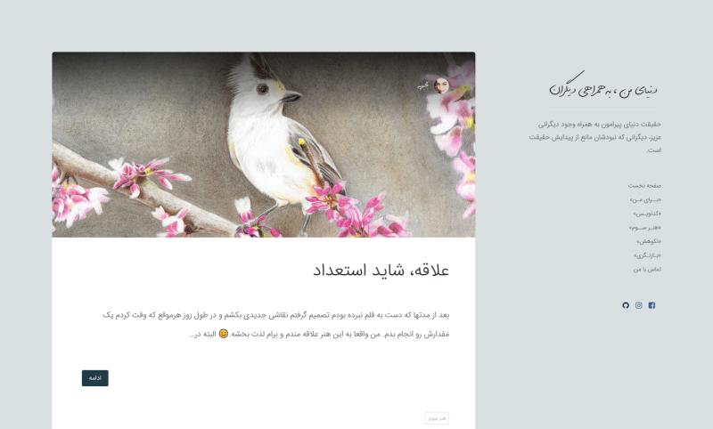
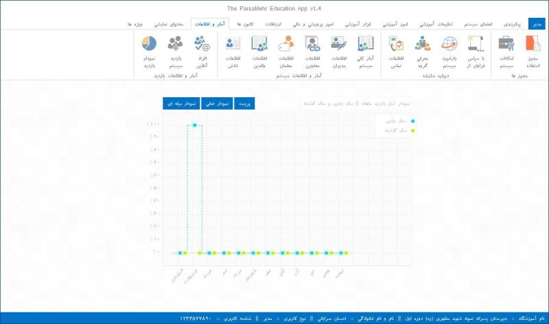
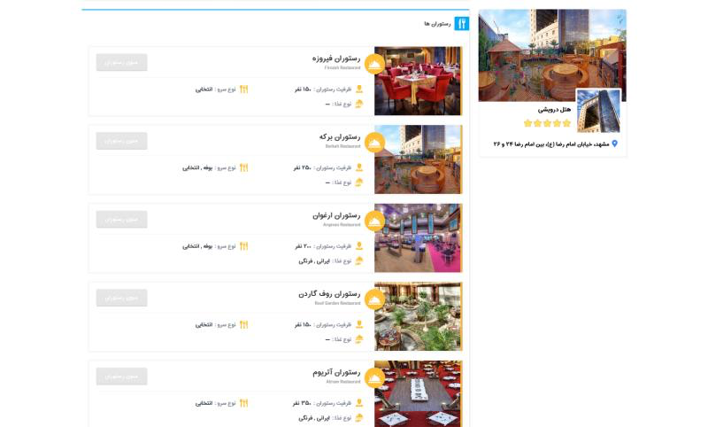
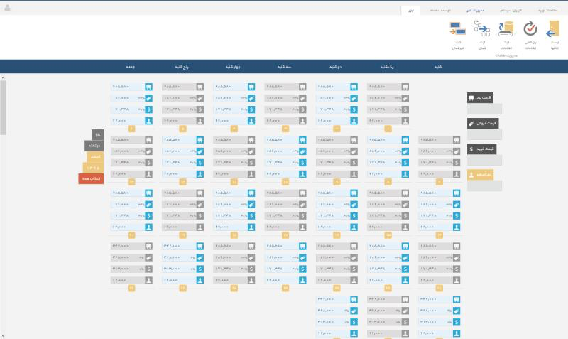
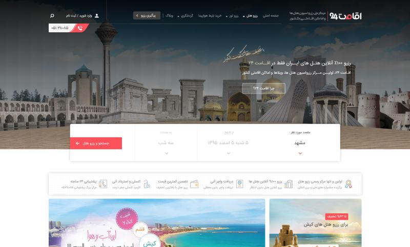
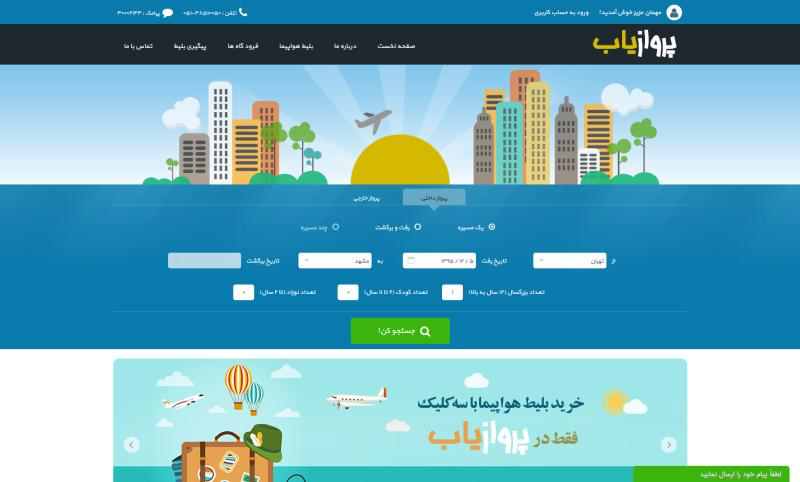
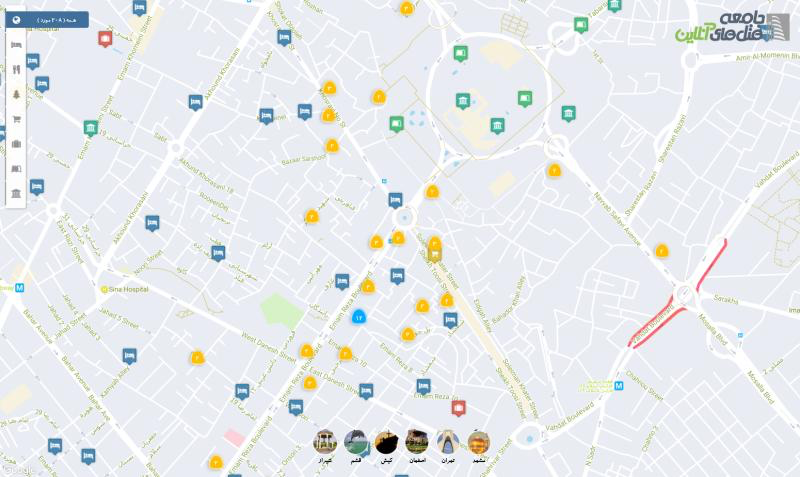
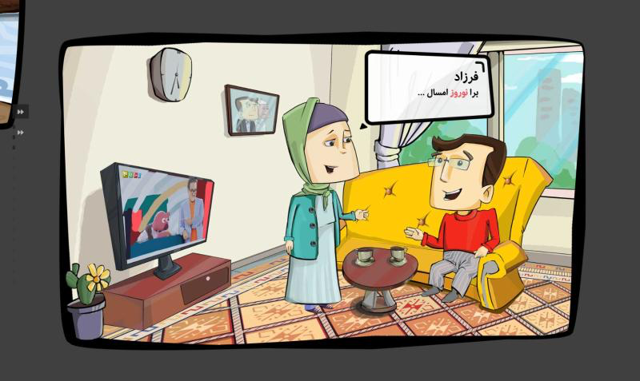
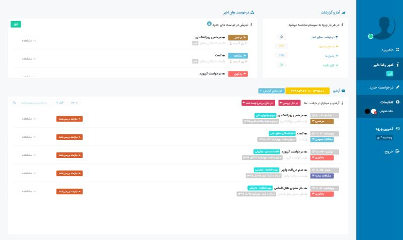
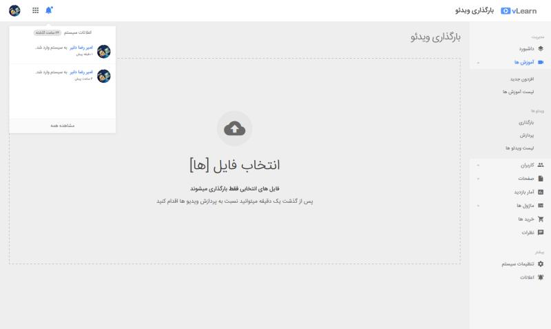

# میراث ذخیره‌نشده

فقط من بودم، یه صفحه نمایش، و این حس که می‌شه از هیچی یه چیزی ساخت. نه ورژن کنترلی بود، نه بکاپی، نه فضای ابری. فقط فایل‌هایی که روی یه لپ‌تاپ 💻 ذخیره می‌شدن. سال به سال، دستگاه به دستگاه، کدها هیچ‌وقت به دستگاه بعدی نرسیدن. همون‌جا موندن و بالاخره از بین رفتن.

هیچ‌کس بهم کدنویسی یاد نداد. نه بوت‌کمپی بود، نه آموزش یوتیوبی، نه جواب‌های Stack Overflow به زبان من. فقط view-source روی سایت‌های بقیه، آزمون و خطا، و این باور سرسختانه که اگه چیزی روی صفحه کار می‌کنه، می‌تونم بفهمم چطوری ساخته شده.

نمی‌دونستم فریم‌ورک چیه. نمی‌دونستم API چیه. فقط یه ویرایشگر متن باز می‌کردم و تایپ می‌کردم تا یه چیزی توی مرورگر اتفاق بیفته. و وقتی خراب می‌شد — که زیاد می‌شد — همه چیز رو پاک می‌کردم و از اول شروع می‌کردم. نه git reset. فقط پاک کردن 🗑️.

چیزی که مونده این اسکرین‌شات‌هاست — تار، با کیفیت پایین، ولی نشون می‌دن که واقعی بود.

---

با یه بلاگ شروع شد. فقط یه **سایت وردپرسی**، چیز خاصی نبود. ولی مال من بود. اولین ردپای من توی اینترنت 🌐. جایی برای نوشتن، برای وجود داشتن آنلاین، برای اینکه حس کنم بخشی از چیزی بزرگ‌تر از اتاقم و لپ‌تاپم هستم. بلاگ سال‌ها زنده بود — این اسکرین‌شات از جایی نزدیک آخرشه، نه اولش. نسخه اولیه فرق داشت. ولی هیچ‌وقت فکر نکردم وقتی تازه شروع شده ازش عکس بگیرم.

---

بعد **سیستم پارسامهر** اومد — اولین پروژه واقعی‌ام. یه سیستم مدیریت مدرسه. کل سیستم رو از اول تا آخر خودم ساختم. ولی هیچ‌وقت از طرف آموزش و پرورش پذیرفته نشد 🚫. هیچ‌وقت اجرا نشد. اون همه کار، و هیچ‌کس ازش استفاده نکرد. دردناک بود. ولی اولین باری بود که یه چیز کامل ساختم — چیزی که می‌تونست واقعی باشه. و همین کافی بود که ادامه بدم.

---

یه جایی تلفن شروع کرد به زنگ زدن 📞. مردم وب‌سایت می‌خواستن. واقعی. از اون‌هایی که پول و مشتری و رزرو رو مدیریت کنه. **سفرینو** یه سیستم رزرو آنلاین بود — از صفر ساخته شده، بدون قالب، بدون راهنما. فقط یه جوون که ساعت ۳ شب 🌙 داشت می‌فهمید درگاه پرداخت چطوری کار می‌کنه. شرکت دیگه وجود نداره. دامنه سال‌ها پیش منقضی شد. ولی برای مدتی، آدم‌های واقعی سفرهای واقعی رو از چیزی که تنها ساخته بودم رزرو کردن.

---

پشت سفرینو، **چمدون** بود — بک‌آفیسی که همه چیز رو سر پا نگه می‌داشت. پنل مدیریتی که اپراتورها باهاش اتاق‌ها، رزروها و قیمت‌ها رو مدیریت می‌کردن. ماشین نامرئی پشت پرده بود 🎭. هیچ‌کس نمی‌دیدش جز کسایی که بهش نیاز داشتن، و باید بی‌نقص کار می‌کرد چون کس دیگه‌ای نبود که درستش کنه اگه خراب می‌شد. اگه دقیق نگاه کنی، شاید شبیه پروژه پارسامهر به نظر برسه. درسته — پروژه‌ای که هیچ‌وقت پذیرفته نشد، بالاخره راهش رو به یه چیز واقعی پیدا کرد.

---

بعد **اقامت۲۴** بود — اولین نقش حرفه‌ای واقعی‌ام. یه سایت رزرو هتل. من اولین توسعه‌دهنده‌ای بودم که روی این سیستم کار کرد. وقتی که رزرو آنلاین هتل توی ایران هنوز ایده جدیدی بود. اینجا بود که دیگه یه بچه‌ای که کد می‌زنه نبودم و تبدیل شدم به یه توسعه‌دهنده 👨‍💻. برخلاف بقیه، این یکی زنده موند. هنوز هم فعاله، سال‌ها بعد، خیلی وقته که کد من بازنویسی شده. ولی با من شروع شد، روی لپ‌تاپم. این اسکرین‌شات از نسخه‌های بعدیه — نسخه اول اصلاً شبیه این نبود.

---

بعد **پروازیاب** اومد. یه پلتفرم رزرو بلیط هواپیما. جستجوی پرواز، انتخاب صندلی، پرداخت آنلاین ✈️. برای مدتی، مسافرهای واقعی پروازهای واقعی رو از چیزی که من ساخته بودم پیدا کردن. کسب‌وکار بالاخره تعطیل شد — بازار بی‌رحم بود و رقبا پول بیشتری داشتن 💰. ولی کد کار می‌کرد. همیشه کار می‌کرد. این اسکرین‌شات از نسخه‌های بعدیه — تا وقتی که به فکر ثبتش افتادم، پروژه خیلی از جایی که شروع شده بود تغییر کرده بود.

---

یه بار یه **نقشه گردشگری** ساختم. هر هتلی توی ایران، روی یه نقشه تعاملی 🗺️. می‌شد شهر به شهر گشت، زوم کرد، جزئیات رو دید. اون موقع حس آینده‌ای بودن می‌داد — کشیدن نقشه توی مرورگر و دیدن اینکه دیتا لحظه‌ای لود می‌شه. انگار آینده داشت جلوی چشمم بارگذاری می‌شد.

---

یه **نمایشگر کمیک‌استریپ** هم بود — چون قرار نبود همه چیز جدی باشه 😄. یه وب‌اپ که می‌شد کمیک‌ها رو پنل به پنل خوند، با انتقال‌های نرم و رفتار تعاملی. ساختمش برای تفریح، فقط برای اینکه ببینم می‌تونم یا نه. هیچ‌کس نخواسته بودش. هیچ‌کس پولی نداد. فقط لذت خالص ساختن چیزی بود که توی مرورگر زنده به نظر می‌رسید.

---

یه جایی بین این‌ها، یه شرکت بهم اعتماد کرد که **داشبورد داخلی**‌شون رو بسازم. سیستمی که عملیات روزانه‌شون رو اداره می‌کرد — تسک‌ها، گزارش‌ها، فرآیندها. هیچ چیز عمومی، هیچ چیز پر زرق و برق. فقط یه توسعه‌دهنده جوون که کلید ستون فقرات یه شرکت رو بهش دادن 🔑، با امید اینکه چیزی رو خراب نکنم. نکردم.

---

و بعد **VLearn** بود. یه سیستم مدیریت آموزش ویدیویی. آپلود دوره، پیگیری پیشرفت، مدیریت دانش‌آموزها. آموزش آنلاین از طریق مرورگر — سال‌ها قبل از اینکه آموزش آنلاین عادی بشه. یه دوست ازم خواست بسازمش، و ساختم — مجانی 🤝، فقط چون می‌تونستم.

---

این‌ها فقط اون‌هایی هستن که ازشون اسکرین‌شات داشتم. خیلی‌های دیگه هم بودن — پروژه‌هایی که ساختم ولی هیچ‌وقت ثبتشون نکردم، اسکرین‌شات‌هایی که با دستگاه‌هایی که روشون ذخیره بودن از بین رفتن. برای همیشه رفتن 💨. حتی یه تصویر تار هم نمونده که ثابت کنه وجود داشتن.

هیچ‌کدوم از این کدها دیگه وجود نداره. نه مخزنی، نه تاریخچه کامیت، نه برنچ و نه تگ. فقط این چند اسکرین‌شات، بیرون کشیده شده از پوشه‌های قدیمی روی دستگاه‌های قدیمی، و خاطره شب‌های طولانی تنها — دیباگ با غریزه، دیپلوی با دعا 🙏، و یاد گرفتن همه چیز از سخت‌ترین راه.

اکثر پروژه‌های اینجا بدون مربی، بدون تیم، بدون تکیه‌گاه ساخته شدن. بعضی‌هاشون پول درآوردن. بعضی‌هاشون به مردم کمک کردن. بیشترشون الان دیگه نیستن.

خوبه که الان گیت‌هاب و فضای ابری رو داریم که کارهامون رو در طول زمان حفظ کنیم ☁️. اون موقع چیزی مثل این نبود — یا حداقل، من نمی‌دونستم هست.

من زندگیم رو با کد ساختم. و هنوز دارم می‌سازم 🚀.
